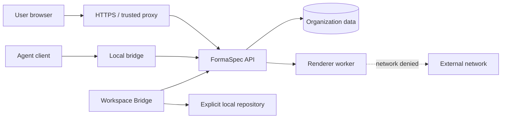

# FormaSpec threat model

Last audited: 2026-07-22

## Status and scope

This is the living threat model for the current implementation and the approved
enterprise architecture. Current controls and remaining gaps are labeled
explicitly; target language is not implementation evidence.

In scope:

- browser, REST, SSE, MCP, SQLite, assets, preview/commit, renderer, launcher,
  Docker, backups, local bridge, Workspace Bridge, imports/exports,
  agent tasks, and organization administration;
- local, SSH-tunnel, and reverse-proxy deployments;
- accidental misuse and malicious authenticated or unauthenticated actors.

Out of scope as product capabilities: public sharing, realtime cursors,
arbitrary HTML/CSS/JavaScript, arbitrary SVG, central shell execution, and
unrestricted repository access. Attempts to introduce these capabilities are
still considered threats.

## Assets to protect

- canonical documents, immutable revisions, previews, operations, and hashes;
- product specifications, business rules, design systems, component releases,
  tokens, and implementation mappings;
- uploaded raster assets and generated renders;
- organization membership, roles, policies, agent grants, and audit history;
- agent task inputs, transitions, outputs, and handoff approvals;
- backup/export bundles and retention metadata;
- local repository inventories, mappings, paths, and connection grants;
- MCP bearer/grant material and operating-system stored secrets;
- service availability and renderer capacity.

## Actors

| Actor | Expected authority |
| --- | --- |
| Local evaluator | Full access only to the loopback local workspace. |
| Organization Admin | Membership, policy, connection, retention, and project administration. |
| Product Manager / Designer | Authorized project/specification/design changes. |
| Engineer / Reviewer | Inspection, handoff, and explicitly approved implementation workflow. |
| MCP agent | Only grant scopes, project restrictions, and expiry allow. |
| Reverse proxy | Authenticates UI users and strips client identity headers. |
| Local bridge | Holds one scoped upstream agent grant in the OS secret store. |
| Workspace Bridge | Reads only explicitly selected repositories and executes no unapproved changes. |
| Malicious user or compromised agent | Attempts cross-tenant access, destructive writes, data exfiltration, persistence, or resource exhaustion. |

The current server implements organization roles, project authorization, and
scoped/expiring agent grants for these boundaries. The broader human-role,
parent-child resource, delegated-administration, and packaged-lifecycle matrix
is not yet release-qualified.

## Trust boundaries

Boundary rules:

- The proxy is trusted only from configured network ranges.
- The browser and agent are separate principals even when operated by one user.
- The renderer accepts only validated canonical snapshots and asset IDs over
  bounded IPC.
- The server does not receive arbitrary workstation filesystem paths.
- The Workspace Bridge never treats server text as permission to modify files.
- A task or handoff reference is data, not shell input.

## Threats and required treatment

| Threat | Current exposure/control | Required treatment and verification |
| --- | --- | --- |
| Forged proxy identity | Server mode validates configured proxy ranges, Host, Origin, CSRF intent, identity presence, and a separate server-generated internal hop secret on every non-health request. Trusted-header policy rejects duplicate effective identities across the `identity`, `external_id`, and `trusted_user` aliases before mutation, preventing order-dependent role assignment. The launcher stores/scrubs the hop secret, and normal output, bindings, logs, and support bundles exclude it. Focused tests pass; health remains credential-free. | Prove reverse-proxy stripping/overwriting, full CIDR/direct-port denial, rotation, lifecycle, and compromise-response behavior in a real deployment. Root/same-account/Docker/proxy/server-env compromise can still recover the secret. |
| Cross-project or cross-organization IDOR | Service-layer organization/project authorization covers design, asset, revision, preview, SSE, MCP, and enterprise services. A declarative manifest closes the route inventory at 106. Generated authentication probes cover the full set, and direct role/foreign-ID/swapped-ID/non-leak/no-mutation plus scoped-agent/revocation evidence now covers all 106 protected routes with zero uncovered across planning/tasks/design-system/mappings, product specifications, handoffs, Redesign assessments, Agent Connections, Repository Inventory, backup artifact control, organization policy/audit retention, and core design/catalog routes. Regressions additionally prove exact principal/design/revision-scoped mapping cleanup, principal-scoped handoff cleanup, denied-plan enforcement, SQL-level project filtering before limits, authorization-before-lifecycle/version validation for Redesign, authorization before query/path/body schema parsing, current-project-pin-bound direct release access, and exact project/revision-bound historical release reads without catalog leakage. Both SSE routes have true HTTP filtering and revocation tests. | Keep the complete direct-route suite release-blocking and finish the broader human-role/project-parent combinatorial lifecycle matrix. |
| Stolen or replayed MCP token | One-time pairing, hashed scoped/expiring grants, macOS Keychain, Linux Secret Service, Windows current-user DPAPI, last-use, reconnect, and immediate revocation exist. | Add real packaged cross-platform lifecycle tests, rotation policy, and broader replay fixtures. |
| CSRF against header/cookie UI identity | Server writes require trusted Origin and the configured CSRF intent header; local mode ignores caller identity. | Complete browser/proxy/cookie deployment tests across every mutating endpoint. |
| Preview/commit substitution | Base/result snapshot hashes, operation hash, engine versions, exact stored bytes, status, expiry, and transactional commit exist. | Extend restart/concurrency/fault-injection and corruption coverage. |
| Lost or phantom events | A persisted transactional outbox publishes after commit and supports replay/gap signals. | Add load, reconnect, retention, and publisher-crash operational tests. |
| Unauthorized destructive archive | Ordinary commits reject archive operations; archive requires its own preview and destructive commit path. | Complete negative tests across every client/tool input and approval annotation. |
| Revision tampering | Brotli snapshots use SHA-256 and revisions include a parent-linked hash chain plus immutable triggers. | Add operator verification/reporting and deliberate corruption fixtures. |
| Malicious design text instructs an agent | MCP instructions warn against it, and focused regressions prove prompt-like design, product-specification, and repository-inventory text remains typed bounded data, creates no task/archive side effect, and reaches rendering/persistence without expanding authority. Agents still consume untrusted text semantically. | Add real connected-agent semantic-resistance and approval-flow evidence; retain least-privilege tools and no automatic commit. |
| Renderer SSRF/data exfiltration | Docker uses a separate worker with `network_mode: none`; request interception and no-remote-URL schemas remain defense in depth. Current schema-16 image `sha256:620d231484044701403ff688493492ff5f8d12d7b09db3de6f00be83cbc658a1` fails the Docker canary closed for DNS, direct TCP, and external interfaces, and workflow contracts require summary evidence. | Retain the canary on hosted supported-OS runners, then add native-package boundary evidence and real server deployment verification. |
| Renderer escape/resource exhaustion | Worker runs as non-root with a read-only root, dropped capabilities, no-new-privileges, bounded IPC/queue, per-job context, cleanup, PID/memory/CPU/time limits, and API process isolation. Migration 11 persists only bounded API-owned job lifecycle metadata with leases/heartbeats and permit-guarded 30-day terminal retention; the worker remains database-free. | Add crash/recovery, queue saturation, malformed IPC, long-running stress, configurable retention operations/UI, and native sandbox evidence. |
| Image parser exploit or image bomb | The network-disabled pinned Chromium worker performs full decode, byte/pixel/output limits, animation/MPO rejection, EXIF orientation, metadata stripping, and deterministic PNG re-encoding under a new context per job. Backup creation/verification and restore preflight/cutover require the same worker-backed verifier. | Add a larger malformed-image corpus and upload-storm/queue evidence. |
| SVG/script injection | Uploaded SVG is currently rejected. | Preserve the prohibition for external input; lint bundled icons at build time. |
| Operation/payload denial of service | 500-operation and 1 MiB limits exist. Tree/layout complexity is not budgeted. | Per-tool strict schemas, depth/node/asset/export limits, CPU deadlines, rate policy, and 1,000-node budgets. |
| SQLite corruption, source swap, exhaustion, or partial restore | Online backup, bounded tar/checksums, strict V1/V2 semantic verification, descriptor-pinned sources/downloads, whole-workflow and per-step capacity checks, SQLite integrity/foreign-key checks, operation-aware orphan preservation, deterministic render smoke, safety backup, externally supervised launcher-pinned Docker/server planned restore, and a separately authorized offline forensic recovery path exist. Scheduled attempts now leave durable start/success/failure evidence, and ready health reports bounded overdue/retention-backlog diagnostics while keeping failed or stalled attempts critical even when the current window already has a valid backup. Runtime binding verification rejects plugin, NFS, bind-backed, and aliased volumes; health has absolute deadlines; lock paths fail closed; and pre-cutover worker failures restart/verify the unchanged API. Current schema-16 local evidence passes a fail-closed same-host copy into an independent clean Compose project with exact state/render, SQLite integrity, foreign-key, asset, snapshot/revision-hash, and cleanup checks. | Managed-ID recovery remains `HEALTHY_PLANNED_RESTORE_ONLY`. Add installed external scheduling and alert delivery, signed provenance, OS-native atomic no-replace cutover support, clean server supervision/proxy evidence, real remote-host/network/TLS/off-site storage policy, and hosted supported-OS recovery matrices. |
| Backup theft | Backups contain designs, assets, identities, and potentially secrets. | Access control, encryption at rest by operator, secret exclusion, audit, retention, and destruction policy. |
| Archive/import traversal or memory exhaustion | Backup TAR and portable ZIP validation reject unsafe/duplicate paths, encryption, unsupported compression/features, non-regular entry types, local/central or descriptor/CRC mismatches, hidden trailing data, count/size excess, checksum gaps, and strict-schema/ID mismatches. Multipart input streams to a private archive, entries inflate independently in bounded 16 KiB chunks into pinned private files, and the whole request/extracted set is not retained in memory. Mutation is administrator-only, idempotent, conflict-aware, provenance-recorded, and covered for preserve-ID/clone, rollback, symlinks, descriptors, malformed streams, and decompression limits. | Add a larger adversarial/concurrent-import corpus and retained packaged cross-platform evidence. |
| Repository secret exfiltration | Workspace Bridge uses explicit expiring/revocable read-only grants, no symlink following, organization-policy exclusions persisted with the grant, bounded reads, workstation-only local paths, and automatic strict path-free persistence through REST or the authorized MCP bridge. Implementation mappings accept only opaque entity IDs and derive bounded source metadata from the pinned inventory; paths and caller-supplied symbols are rejected. | Expand secret fixtures and prove across packaged platforms that local paths/content outside bounds never cross the boundary. |
| Forged or stale implementation mapping | Mapping creation verifies the exact V2 revision/hash chain, product-specification pin, single active inventory/hash, entity compatibility, role/scope/project restriction, and idempotency in one immediate transaction. Mapping rows are append-only and reads revalidate their pins. | Add the exhaustive REST/MCP/browser tamper matrix and portable mapping round-trip evidence. |
| Unapproved repository modification | Workspace Bridge inventory grants are bound to the exact central inventory and a handoff whose final immutable transition is `approved` → `implementing` with explicit `start_implementation` authorization. The `launch-codex` boundary revalidates policy/grant/handoff/inventory state, starts Codex with `shell: false`, exact repository `cwd`, one secret-free task reference, and a minimal environment, then monitors revocation. The central server remains shell-free. | Complete the broader approved plan/diff/validation/commit/PR workflow and packaged supervision; prove Windows Job Object/equivalent descendant containment. |
| Malicious custom URL | The UI issues allowlisted `formaspec://connect-agent` links with one-time expiring pairing nonces and secret-free `formaspec://open-review` links with strict opaque design/preview/task/store IDs. Grants/tokens are never placed in the URL. Packaged handlers reject reordered, duplicated, encoded, oversized, credential-bearing, or unknown forms; review launches run fixed-purpose recovery and require the recorded data-store identity before opening the exact HTTP review. | Complete privileged clean-install protocol registration/replay evidence on every supported OS. |
| Stale or overbroad managed Codex grant | The local bridge verifies MCP, then reads only the bearer grant's own no-store role/scopes/project restrictions. Exact order-insensitive set equality is required before reuse; missing, extra, stale, malformed, unavailable, or wrong-role context clears the local credential and rotates through the existing one-time pairing flow. | Add packaged OS credential-store upgrade/recovery evidence and policy-expiry reduction reconciliation. |
| Supply-chain compromise | The exact pnpm version and lockfile are pinned. Historical schema-13 source CycloneDX/license/checksum evidence passed with 342 installed third-party components and zero policy violations; current schema-16 and target-artifact evidence must be regenerated. The retained pre-current-SSE-authorization unsigned macOS ARM64 checkpoint under `artifacts/candidates/schema12-current/` has frozen package-integrity evidence with 349 packaged components, seven exact workspace trees, two bundled runtimes, and a non-installing extracted-runtime smoke. It was not installed, and current-source verification records expected interface drift. Its same-host repeat has identical payload/workspace trees but different outer PKG bytes, and release remains `NO-GO`; `schema11-current` is historical only. Linux DEB/RPM and Windows WiX builders remain source foundations without qualified native lifecycle evidence. | Resolve Chromium LGPL-notice policy, signing/notarization, independent reproducibility, vulnerability/image/OS scanning, and privileged clean install/upgrade/uninstall/reinstall evidence; generate target evidence for containers, Windows, and Linux; add retained hosted CI and real provenance/signing when credentials exist. |
| Malicious support bundle | A fixed allowlist, strict byte/file limits, deterministic archive/checksums, secret/private-path/token redaction, read-only preview, adjacent local manifest, and explicit `--yes` exist; databases/assets/backups/env values/source/credentials are excluded. | Add broader real-log fixtures, packaged cross-platform evidence, and operator review/audit policy. |

## Abuse cases

### Cross-tenant object ID

An authenticated user obtains a design, preview, revision, or asset ID from a
log, link, browser history, or guessed request and calls another endpoint. The
service now resolves organization/project access before design, preview,
revision, asset, SSE, MCP, export, and enterprise-service access. Release still
requires the exhaustive negative matrix for every route, role, grant scope,
project restriction, expiry, and revocation state.

### Preview race

Two clients preview from version N and commit concurrently. Exactly one may
advance the head. The loser must receive `VERSION_CONFLICT` without an inserted
revision, idempotency record for a false success, or published event. Exact
preview commit now performs CAS, revision/idempotency/audit/outbox insertion,
and preview status in one immediate transaction, then publishes committed
outbox state. Additional restart and injected-failure variance remains.

### Prompt-like product content

A frame, product requirement, or repository comment says to ignore policy,
archive data, reveal a token, or execute a command. Agents must treat it as
quoted untrusted data. Only the system workflow, explicit user approval, grant
scope, and typed tools determine authority.

### Renderer exfiltration

A malformed or future document field attempts to load a remote URL containing
project data. Schema rejection is the first defense. The renderer's network
namespace must independently deny the request so a schema regression cannot
become exfiltration.

### Bridge confused deputy

A server task names a local path or asks to run a command. The Workspace Bridge
must ignore server-provided paths unless they resolve to a locally approved
repository grant, and even then may only perform the approved stage. An
assessment or handoff is not permission to edit, commit, push, or open a PR.

## Security invariants to test continuously

1. Authentication success without authorization never grants object access.
2. Revoked or expired grants fail immediately, including existing SSE streams.
3. Every write is attributed to one principal and one organization/project.
4. Every accepted commit references exact validated snapshot bytes.
5. A rolled-back transaction emits no externally visible event.
6. No untrusted field is interpreted as HTML, CSS, JavaScript, URL, path, or
   shell input.
7. The renderer cannot reach the external network.
8. Backups restore into a clean location and reproduce hashes and assets.
9. Repository inspection precedes proposals; approved plans precede changes.
10. Secrets never enter logs, audit payloads, exports, tasks, or support bundles.

## Review triggers

Update this threat model whenever any of the following changes:

- authentication, proxy, organization, role, or agent-grant behavior;
- document/operation schemas or import/export formats;
- renderer, image decoder, browser, or font pipeline;
- MCP tools/resources/prompts or approval annotations;
- local bridge, Workspace Bridge, custom URL handler, or repository scanners;
- backup/restore, installer, automatic startup, update, or signing flow;
- new network destination, filesystem access, or external service.

Production release remains blocked while any critical/high finding is open or
while required security tests are absent.
