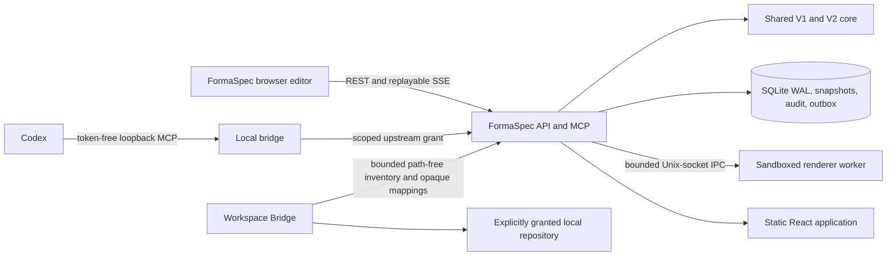
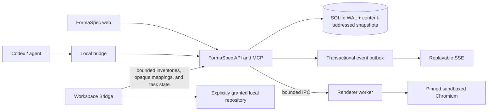

# FormaSpec architecture

Last audited: 2026-07-21

This document distinguishes the architecture that exists in the repository
today from the approved FormaSpec target. A target description is not evidence
that the subsystem has been implemented.

## Current system

The product is named FormaSpec. **Minimal UI** is the agent-facing alias and
`designer` remains only as a compatibility launcher for existing local state.
The repository is an incremental pnpm TypeScript workspace:

| Area | Current implementation |
| --- | --- |
| Shared model | `packages/core`: frozen strict V1 schemas, separate strict V2 schemas, deterministic V1→V2 conversion, typed operations, validation/linting, layout rules, product-specification types, the Foundation System, and bounded token exporters. |
| Browser editor | `apps/web`: React/Vite, Zustand, structured DOM rendering, one viewport transform, Moveable/Selecto in an untransformed interaction overlay, product specification, planning, design-system administration, engineering handoff, Redesign Studio, inspect, history, prototype, JSON/PNG, and portable export/import surfaces. |
| HTTP service | `apps/server`: Fastify REST, replayable SSE, Streamable HTTP MCP, static assets, organization/project authorization, SQLite persistence, exact previews, revision-pinned inspection, design-system releases/pins/upgrades plus project/revision-bound historical release reads, path-free inventories, exact implementation mappings, handoffs, Redesign Studio, audit/outbox, portable export/import, backups, and render orchestration. |
| Persistence | Better SQLite3 with a numbered version-12 migration ledger, WAL, content-addressed Brotli snapshots, immutable revision hash chains and implementation mappings, scoped idempotency, audit records, a transactional event outbox, bounded audit-retention evidence, immutable portable-import provenance, persistent render jobs, and append-only handoff execution decisions. |
| Rendering | Source development may use an explicitly allowed in-process renderer. Docker runs a separate non-root Playwright worker over a bounded Unix-socket protocol with no network, a read-only root filesystem, resource limits, and no software fallback. |
| Agent connection | `apps/local-bridge` provides the loopback authorization boundary and OS credential-store integration; `formaspecctl` configures token-free Codex MCP plus the managed Minimal UI plugin/skill. |
| Workspace handoff | `apps/workspace-bridge` provides explicit, expiring, revocable read-only repository grants, organization-policy exclusions, bounded secret-excluding inventories, and automatic path-free persistence through REST or the authorized MCP bridge. The server persists strict inventories, exact revision/product-spec/inventory-pinned mappings, and revision-pinned handoffs; local launch requires the immutable `start_implementation` transition. Automatic mapping suggestions and independently approved plan/diff/validation/commit/push/PR execution remain incomplete. |
| Packaging | One `formaspec/server` image runs API and renderer as separate services. `formaspecctl` and `designer` support source installs. The runtime build context excludes documentation, CI control files, scripts, and prior evidence so recording an image does not alter its bytes. The retained pre-current-SSE-authorization unsigned macOS ARM64 engineering checkpoint is `artifacts/candidates/schema12-current/installers/FormaSpec-0.2.0-macos-arm64-unsigned.pkg` (SHA-256 `9724f2874c520b5b2b2fa99419978c392a22ee2f534ec9c1ca6e6c49db3fea18`, 185,279,180 bytes). Its frozen source/license and package-integrity checks pass, and a non-installing extracted-runtime smoke verifies bundled Node/Chromium, schema-12 health, real PNG rendering, the exact 51-tool/25-resource MCP inventory, and native state paths. It was not installed, and current-source verification records expected interface drift. A same-host repeat produced identical payload/workspace trees but different outer PKG bytes, so reproducibility, Chromium LGPL-notice approval, vulnerability scanning, signing/notarization, and clean native lifecycle evidence remain blockers; `schema11-current` is retained historical evidence only. Exact-current Docker project `formaspeccischema118e2818fed6`, built from source identity `local-uncommitted-final437-eventauth-sqlbounded-cli`, passes migration 12, deterministic restart rendering, backup-supervision readiness, and the DNS/TCP/interface egress canary with image `sha256:39667c3304d926288ef9d73c59eee85164c435d46cf362b18ef1b22f0331fd7f`; that exact image also passes Firefox/WebKit 12/12 once and the same-machine independent-target copied-bundle recovery simulation. The immediately prior fit-sync image contributes three identical Firefox/WebKit 12/12 repeats as historical browser-stability evidence. All of this remains local `NO-GO` evidence rather than hosted provenance, privileged native lifecycle, or remote/off-site proof. Linux DEB/RPM and Windows WiX source-builder foundations exist, but no release-qualified artifact or native lifecycle evidence is delivered for those targets. |

### Current authoritative data flow

1. The browser or MCP client reads a design and its current integer version.
2. Changes are represented as V1 typed operations.
3. The shared command engine validates and applies the operation batch to a
   persisted ephemeral preview with engine versions, hashes, diagnostics,
   permanent-ID mapping, changed IDs, expiry, and status.
4. The caller renders, inspects, and lints the exact preview before approval.
5. Commit uses one `BEGIN IMMEDIATE` transaction to authorize, enforce scoped
   idempotency, validate the preview, reference its exact snapshot, insert the
   immutable revision/hash chain, compare-and-swap the head, and write audit
   plus event-outbox records.
6. Only committed outbox records are published to open editors. Reconnects use
   persisted monotonic IDs and `Last-Event-ID`; gaps require an authoritative
   refetch and are never auto-merged.

Portable import is a separate bounded workflow. `POST /api/imports/validate`
parses and validates without creating project state. `POST /api/imports`
requires Organization Administrator authorization and an idempotency key,
revalidates the same bundle, chooses preserve-ID conflict failure or
deterministic clone remapping, normalizes render-ready rasters through the
isolated worker, rebases the document and optional product specification to
local version 1, and commits project/revision/specification/provenance/audit/
outbox state together. The imported source revision hash remains an explicit
provenance claim; the new local revision receives its own verified snapshot and
revision hashes. The multipart body streams to a private archive while ZIP
entries inflate independently in bounded 16 KiB chunks into pinned private
files after strict metadata/type/CRC/descriptor/size validation. The complete
request and extracted set are not held in memory simultaneously; individual
bounded JSON or raster entries are loaded only when parsed or normalized.

### Current storage model

| Table | Purpose | Important limitation |
| --- | --- | --- |
| `designs` | Organization-owned current head with optimistic versioning | Backup-gated V2-head migration exists; operator migration UI, broader customer fixtures, and complete project policy UI remain incomplete. |
| `revision_snapshots` / `revisions` | Brotli canonical bytes plus immutable parent/snapshot/operation/metadata hash chains | Real copied legacy upgrade fixtures and operator integrity tooling remain release evidence gaps. |
| `previews` | Exact persisted snapshots, base/result hashes, engine versions, temporary-ID map, changed IDs, expiry, kind, and status | Complete fault injection and every engine-mismatch/already-committed case remain to be proven. |
| `idempotency` | Organization/principal/scope/key response cache committed atomically with writes | Larger restart/concurrency matrices remain. |
| `assets` | Fully decoded deterministic PNG/JPEG/WebP, content-addressed files, and verified legacy-BLOB quarantine fallback | Decode/normalization uses the isolated renderer worker; operator-approved legacy cleanup and broader malformed-image/load evidence are not implemented. |
| `render_jobs` | Bounded request/output hashes and lifecycle metadata for render and raster-normalization jobs; owner leases protect rolling processes, and exact permit-based 30-day retention deletes one organization/internal scope per bounded batch. Raw documents, assets, paths, and PNG bytes are never stored. | Organization-configurable retention, dashboards, and packaged load evidence remain incomplete. |
| `event_outbox` | Organization/project-scoped replayable SSE source with guarded retention of published rows and explicit replay gaps | Operational lag monitoring and high-load reconnect evidence remain. |
| `audit_retention_previews` / `audit_retention_runs` | Exact expiring retention plans plus immutable SHA-256 chained execution evidence | Administration UI and long-running scheduled execution remain. |
| `portable_imports` | Immutable organization-scoped source bundle/revision hash claims, target revision, canonical ID map, manifest, diagnostics, actor, and timestamp | The source revision hash is preserved as a provenance claim; it is not revalidated as a local revision chain. Multipart and per-entry disk staging are bounded, but larger adversarial/concurrent-import and packaged cross-platform evidence remain incomplete. |
| `handoff_execution_decisions` | Append-only, handoff-version-pinned plan/isolation/diff/validation/commit/push/PR decisions with evidence hashes, explicit supersession, and lifecycle/CAS triggers | Broader packaged-agent and real-repository execution evidence remains incomplete. |
| Enterprise workflow tables | Organizations, principals, roles, grants, audit, product specs, planning, tasks, connections, design systems/releases/pins, repository inventories, handoffs, redesign assessments, backup/export metadata, and locks | V2-head migration, full authoring/mapping/implementation integration, delegated administration, policy rollout/version migration, and complete retention workflows remain incomplete. |

The `schema_migrations` ledger and database, document, command-engine,
renderer, font, application, and export versions are explicit and synchronized
between server and CLI at database schema version 12. Migration 8 is an
expand-only correction that adds the previously missing design-system,
repository-inventory, handoff, implementation-mapping, and Redesign Studio
tables. Migration 9 adds bounded preview-first audit/outbox retention with
temporary exact-delete permits and an immutable run hash chain. Migration 10
adds immutable portable-import provenance. Migration 11 adds bounded persistent
render-job lifecycle records and strict transition/immutability constraints.
Migration 12 adds append-only handoff execution decisions and their exact
sequence/supersession/lifecycle integrity triggers. None of these migrations
changes V1 revisions or removes legacy columns.

The migration ledger is necessary but not sufficient. Database startup and
backup/restore verification validate the required migration-9/10/11/12 tables,
columns, indexes, trigger targets/SQL, and forbidden legacy triggers. A database
that claims a ledger version without the required schema shape fails closed.
Deterministic historical fixtures build schema 1 and schema 7–11 by applying
the real migration prefix to a fresh database, with reviewed schema/data
digests; they do not derive old schemas by dropping current tables.

### Current renderer topology

Docker uses two services from the same image. The API sends bounded, versioned
requests through `/run/formaspec/renderer.sock`. The renderer runs as `pwuser`
with `network_mode: none`, a read-only root filesystem, all capabilities
dropped, `no-new-privileges`, PID/CPU/memory limits, deterministic locale,
timezone, and DPR, a new browser context per job, bounded queue/concurrency,
and guaranteed cleanup. `/health/ready` and `/health/render` fail when the
worker is unavailable; production has no silent software fallback.

The API records each dispatched render or raster-normalization job as
`queued`, `running`, and exactly one terminal `succeeded` or `failed` state.
Only bounded hashes, versions, dimensions, warnings, and safe error metadata
are persisted. The worker remains database-free. API owners renew short leases;
startup and periodic maintenance mark only expired nonterminal rows failed and
retryable, so a rolling second API process cannot invalidate live work.

Windows named-pipe support, self-contained native worker packaging, and a
continuous automated infrastructure-egress test remain incomplete.

## Corrected defects and remaining architectural risks

The reproduced approximately 149% zoom/pan selection drift is corrected by one
`ViewportTransform`, a viewport-coordinate interaction overlay, explicit
Moveable root/container relationships, accurate positioning, and coalesced
geometry invalidation. The automated Chrome gate currently passes DPR 1/2,
12/25/50/100/149/150/200/320% zoom, positive/negative fractional pan,
LTR/RTL/mixed and nested rotated single selection, and fractional-coordinate
multi-selection within 0.75 CSS px at DPR 1 and 2.

Remaining risks are explicit:

- React Moveable still rounds fractional child offsets for group selections;
  FormaSpec keeps Moveable as the group gesture engine and renders the
  non-resizable group border from an exact client-space target union.
- Auto-layout drag/reparent/constraint semantics are not complete.
- The representative 1,000-node service and 20-sample pinned-Chromium browser
  gates pass locally, but their reports are not yet retained across pinned
  release CI images and supported platforms.
- Verified backup/retention and launcher-local Docker supervision exist, and an
  isolated 20-step source-local restore scenario plus deterministic schema 1
  and schema 7–11 fixtures pass; server-mode external supervision, signed
  provenance, anonymized real-customer fixtures, and the full asset/failure-
  injection recovery matrix remain incomplete.
- Strict V2 heads, immutable release pinning/upgrades, and backup-gated
  migration foundations exist; complete component-authoring and upgrade-review
  UI remains incomplete.
- The Workspace Bridge persists bounded inventories, exact opaque mappings,
  and handoffs. Selected-workspace launch now requires the immutable
  `start_implementation` transition; the broader independently approved
  plan/diff/validation/commit/push/PR execution workflow is not complete.
- Privileged native lifecycle, Windows named pipes and packaged DPAPI
  verification, container/Windows/Linux artifact evidence, vulnerability and OS
  scanning, retained hosted/OS visual regression, and the full security matrix
  remain release blockers. The Sharp-free source license gate and current
  macOS package SBOM/integrity evidence pass with zero policy violations.

## Approved target architecture

The upgrade remains incremental. Existing packages are extended rather than
rewritten merely to match a directory diagram.

Target runtime boundaries:

- `formaspec/server` contains the frontend, API, MCP endpoint, migrations,
  renderer worker executable, Chromium, fonts, icons, templates, and foundation
  design system.
- API and renderer run as separate non-root processes. Unix sockets are used on
  macOS/Linux and named pipes on Windows.
- The local bridge is separately installed and stores upstream grants in the
  operating-system secret store. Browser actions create immutable agent tasks;
  the website never calls an OpenAI API directly.
- The Workspace Bridge is a workstation-only process. Repository paths,
  credentials, and development tools never enter the central server trust
  boundary.
- Source installs may use Node and pnpm. Packaged installs ship pinned,
  self-contained executables and do not require either tool.

## Version and migration architecture

V1 semantics are frozen. Historical V1 revisions stay immutable and exportable.
V2 is a separate strict schema for design-system links, component instances,
product specifications, semantic roles, implementation mappings, and
organization references.

The required database migration sequence is:

1. Add a numbered migration ledger and independent engine/build versions.
2. Backfill one legacy organization, principals, memberships, roles, scoped
   agent grants, project ownership, policy, and append-only audit events.
3. Add Brotli-compressed content-addressed snapshots, revision hash chains,
   exact preview metadata/status, scoped idempotency, and an event outbox.
4. Add render jobs and content-addressed normalized assets while retaining
   legacy BLOBs in quarantine.
5. Add V2 design systems, releases, component definitions, product
   specifications, planning sessions, and implementation mappings.
6. Add agent tasks and transitions, connections, handoffs, repository
   inventories, and redesign assessments.
7. Add backup records, schedules, retention, portable exports, and operational
   locks.

The current repository records the first seven implementation slices, an
eighth expand-only corrective migration for domain tables that were not yet
materialized by the earlier broad workflow migrations, migration 9 for guarded
audit/outbox retention execution, and migration 10 for immutable portable-
import provenance, migration 11 for persistent render-job lifecycle state, and
migration 12 for append-only handoff execution decisions.

No V2 project-head migration may run before a verified backup and clean restore
test. The deterministic V1-to-V2 migration must preserve project, page, frame,
node, token, asset, and prototype IDs. Legacy free-form overrides are retained
as non-rendered quarantine data with diagnostics. A system-authored migration
revision advances only the current head; historical V1 revisions are not
rewritten.

### Canonical snapshot rules

The persistence layer implements these rules:

- Canonical document bytes are encoded deterministically.
- `snapshot_hash = SHA-256(uncompressed canonical document bytes)`.
- A revision hash covers its parent revision hash, snapshot hash, operation
  hash, and canonical revision metadata.
- Commit timestamps belong to revision metadata, not a mutation of the preview
  document.
- A preview records base and result hashes, command-engine/renderer/font
  versions, status, expiry, operation hash, permanent temporary-ID mapping, and
  changed node IDs.

### Atomic preview commit

The implemented exact-preview commit uses one `BEGIN IMMEDIATE` transaction:

1. authorize the organization, project, actor, and grant;
2. enforce payload and engine-version limits;
3. resolve scoped idempotency;
4. validate preview state, expiry, hashes, and expected base version;
5. reference the exact stored snapshot;
6. insert the immutable revision and hash-chain metadata;
7. compare-and-swap the project head;
8. insert audit and event-outbox rows;
9. persist the idempotent response and mark the preview committed;
10. commit, then publish only committed outbox events.

V1 never auto-merges. A stale base returns `VERSION_CONFLICT` and the caller
must read the new head and create another preview.

## Stable boundaries

FormaSpec remains a structured UI system, not a general vector editor. The
following stay out of scope: pen tools, boolean vector operations, arbitrary
SVG/HTML/CSS/JavaScript, animation timelines, realtime cursors, public sharing,
Figma import, central shell execution, unrestricted code generation, and
unrestricted repository access.

See [EDITOR_COORDINATES.md](./EDITOR_COORDINATES.md) for the canvas contract,
[SECURITY.md](./SECURITY.md) for deployment boundaries, and
[IMPLEMENTATION_STATUS.md](./IMPLEMENTATION_STATUS.md) for actual delivery
status.
