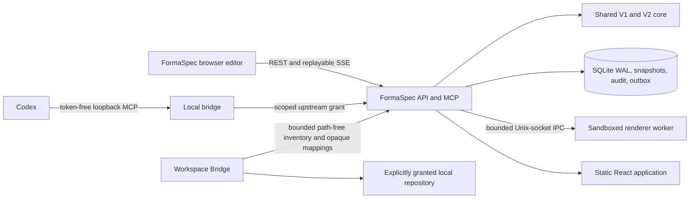
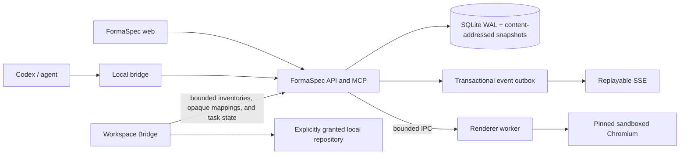

# FormaSpec architecture

Last audited: 2026-07-22

This document distinguishes the architecture that exists in the repository
today from the approved FormaSpec target. A target description is not evidence
that the subsystem has been implemented.

## Current system

The product and primary agent-facing identity are **FormaSpec**. `designer`
remains only as a compatibility launcher for existing local state.

> **Backward compatibility:** **Minimal UI** is a legacy agent alias for
> existing prompts and integrations. It shares the token-free `formaspec` MCP
> server with the primary version-0.2.0 FormaSpec plugin.
The repository is an incremental pnpm TypeScript workspace:

| Area | Current implementation |
| --- | --- |
| Shared model | `packages/core`: frozen strict V1 schemas, separate strict V2 schemas, deterministic V1→V2 conversion, typed operations, validation/linting, layout rules, product-specification types, the Foundation System, bounded token exporters, and canonical bounded detached component-source bundles. The core operation union includes a server-only `insert_component_instance` record, but generic MCP operations exclude it. |
| Browser editor | `apps/web`: React/Vite, Zustand, structured DOM rendering, one viewport transform, Moveable/Selecto in an untransformed interaction overlay, product specification, planning, source-backed component authoring from immutable V2 revisions, and a Components-tab pinned-library flow that previews, renders, diagnoses, explicitly commits, or discards exact component insertions. Design-system administration, engineering handoff, Redesign Studio, inspect, history, prototype, JSON/PNG, and portable export/import surfaces also exist. |
| HTTP service | `apps/server`: Fastify REST, replayable SSE, Streamable HTTP MCP, static assets, password-session and trusted-header browser authentication, organization/project authorization, SQLite persistence, exact previews, revision-pinned inspection, source-backed design-system releases/pins/upgrades, exact pinned-release component insertion previews, project/revision-bound historical release reads, path-free inventories, exact implementation mappings, handoffs, Redesign Studio, audit/outbox, portable export/import, backups, and render orchestration. |
| Persistence | Better SQLite3 with a numbered version-16 migration ledger, WAL, content-addressed Brotli snapshots, immutable revision hash chains and implementation mappings, scoped idempotency, audit records, a transactional event outbox, bounded audit-retention evidence, immutable portable-import provenance, persistent render jobs, append-only handoff execution decisions, canonical component source JSON/SHA-256, exact design-system upgrade snapshot references, hardened browser-account/session/bootstrap/login-attempt state, bounded write-once exact preview-render metadata, and a canonical consume-once bootstrap-credential trigger. |
| Rendering | Source development may use an explicitly allowed in-process renderer. Docker runs a separate non-root Playwright worker over a bounded Unix-socket protocol with no network, a read-only root filesystem, resource limits, and no software fallback. |
| Agent connection | `apps/local-bridge` provides the loopback authorization boundary and OS credential-store integration; an authenticated Organization Administrator creates a short-lived pairing ticket, the bridge consumes only its nonce through `/api/agent-connections/pair`, and `formaspecctl` configures token-free Codex MCP plus the primary managed FormaSpec plugins/skills and the Minimal UI legacy compatibility assets. |
| Workspace handoff | `apps/workspace-bridge` provides explicit, expiring, revocable read-only repository grants, organization-policy exclusions, bounded secret-excluding inventories, and automatic path-free persistence through REST or the authorized MCP bridge. The server persists strict inventories, exact revision/product-spec/inventory-pinned mappings, and revision-pinned handoffs; local launch requires the immutable `start_implementation` transition. Automatic mapping suggestions and independently approved plan/diff/validation/commit/push/PR execution remain incomplete. |
| Packaging | One `formaspec/server` image runs API and renderer as separate services. `formaspecctl` and `designer` support source installs. Current local schema-16 image `sha256:620d231484044701403ff688493492ff5f8d12d7b09db3de6f00be83cbc658a1` passes deterministic restart rendering, egress denial, Firefox/WebKit 12/12, and copied-bundle recovery; its compatibility evidence paths remain under `artifacts/ci/docker-schema11/`. It is local uncommitted-source evidence, not hosted/signed/scanned release provenance. The retained unsigned macOS schema-12 checkpoint remains historical 51-tool/25-resource evidence, was not installed, and is nondeterministic at the outer PKG layer. All evidence remains `NO-GO`; native macOS/Linux/Windows lifecycle proof is missing. |

Current source advertises 52 MCP tools and 25 resources. The protected non-MCP
manifest contains 108 routes: 54 project-scoped, 48 organization-scoped, and
six explicit exceptions. The current application suite verifies exact
inventory/route closure, generated authentication rejection, and direct
behavioral authorization across all 108 routes with zero uncovered.

Historical local dependency-linked schema-13 runtime evidence uses disposable Compose
project `formaspeccischema1369037dfc8a`. Image
`sha256:55601784007855ffac507b20c8025d64d9ca5f572eb9a2834a0fb239a30378a0`
produced the same 512×339 PNG hash before and after API restart, denied DNS/
direct-TCP/non-loopback egress, passed Firefox/WebKit 12/12, and passed
source-to-clean-target copied-bundle recovery with exact database, snapshot,
revision, asset, render, integrity, and foreign-key comparisons. Cleanup passed
for every disposable project. These are historical local `NO-GO` results, not
the current schema-16 checkpoint, hosted provenance, or a release image.

Installed/link verification confirms `drizzle-orm` 0.45.2. Current schema-16
source passes the seven-package test suite 842/842 (core 59, server 467, web 91,
CLI 96, local bridge 20, Workspace Bridge 37, and installer 72), all workspace
typechecks/builds, launcher 225/225, Compose configuration, targeted editor/
Administration 5/5, release E2E 1/1, preview integration 2/2, Chromium and
Firefox/WebKit alignment 12/12 each, visual regression 7/7, the 1,000-node
browser budgets, and macOS runtime-smoke contracts 11/11. Current local Docker
restart/egress and copied-bundle recovery evidence uses image
`sha256:620d231484044701403ff688493492ff5f8d12d7b09db3de6f00be83cbc658a1`.
The exact SBOM/license result remains historical schema-13 evidence; hosted,
installed-native, current security/image/OS scan, and real remote-host/TLS
matrices remain open.

### Current authoritative data flow

1. The browser or MCP client reads a design and its current integer version.
2. Ordinary changes are represented as typed public operations. Linked
   component insertion is resolved server-side from the project's exact pinned
   release and produces a prepared `insert_component_instance` preview; callers
   cannot supply component source trees through generic operations.
3. The shared command engine validates and applies the operation batch to a
   persisted ephemeral preview with engine versions, hashes, diagnostics,
   permanent-ID mapping, changed IDs, expiry, and status.
4. The caller renders, inspects, and lints the exact preview before approval.
5. A website-created task transitions to `awaiting_approval` with the exact
   preview ID and stops; a human commits or discards it in FormaSpec. A direct
   non-task MCP client may commit only after its normal write approval.
6. Commit uses one `BEGIN IMMEDIATE` transaction to authorize, enforce scoped
   idempotency, validate the preview, reference its exact snapshot, insert the
   immutable revision/hash chain, compare-and-swap the head, and write audit
   plus event-outbox records.
7. Only committed outbox records are published to open editors. Reconnects use
   persisted monotonic IDs and `Last-Event-ID`; gaps require an authoritative
   refetch and are never auto-merged.

Source-backed components use a separate resolution boundary. Authoring captures
one authorized immutable V2 revision into a bounded detached source bundle and
stores its canonical JSON and SHA-256 with the component version. Insertion
resolves only the project's exact pinned release, verifies source/release
identity, hydrates transitive token aliases, materializes deterministic
archived/locked masters, and produces an ordinary exact preview. The MCP tool
renders that preview. A direct non-task client may call
`design_commit_preview` after write approval; a website task records the
preview for human approval instead. Asset-bearing sources and non-empty
property/slot overrides fail closed until hash-based asset copying and visual
binding semantics exist.

Portable import is a separate bounded workflow. `POST /api/imports/validate`
parses and validates without creating project state. `POST /api/imports`
requires Organization Administrator authorization and an idempotency key,
revalidates the same bundle, chooses preserve-ID conflict failure or
deterministic clone remapping, normalizes render-ready rasters through the
isolated worker, rebases the document and optional product specification to
local version 1, and commits project/revision/specification/provenance/audit/
outbox state together. The imported source revision hash remains an explicit
provenance claim; the new local revision receives its own verified snapshot and
revision hashes. The multipart body streams to a private archive while ZIP
entries inflate independently in bounded 16 KiB chunks into pinned private
files after strict metadata/type/CRC/descriptor/size validation. The complete
request and extracted set are not held in memory simultaneously; individual
bounded JSON or raster entries are loaded only when parsed or normalized.

### Current storage model

| Table | Purpose | Important limitation |
| --- | --- | --- |
| `designs` | Organization-owned current head with optimistic versioning | Backup-gated V2-head migration exists; operator migration UI, broader customer fixtures, and complete project policy UI remain incomplete. |
| `snapshots` / `revisions` | Brotli canonical bytes plus immutable parent/snapshot/operation/metadata hash chains | Real copied legacy upgrade fixtures and operator integrity tooling remain release evidence gaps. |
| `previews` | Exact persisted snapshots, base/result hashes, engine versions, temporary-ID map, changed IDs, expiry, kind, status, and bounded write-once page/node/max-size render options, dimensions, renderer backend, warnings, and PNG SHA-256 | Complete release-candidate fault injection and every engine-mismatch/already-committed case remain to be proven. |
| `idempotency` | Organization/principal/scope/key response cache committed atomically with writes | Larger restart/concurrency matrices remain. |
| `password_accounts` / `bootstrap_credentials` | Exactly one enabled human Organization Administrator may own the immutable bootstrap account identity. Passwords use versioned scrypt hashes. Public server bootstrap stores only the installer-generated token SHA-256 and permits one atomic consumption of the fixed `initial_admin` credential. | Password recovery/change and delegated account administration are not implemented; this is intentionally a single-administrator V1 session boundary. |
| `browser_sessions` / `login_attempts` | Browser sessions persist only SHA-256 token/CSRF hashes, immutable identity and absolute-expiry metadata, sliding idle expiry, revocation, and bounded global/source/known-identity login-failure buckets. Session actors bind the session ID to the principal ID and revalidate live state on every authorization decision. | Broader multi-process, real-proxy/TLS, sustained-abuse, clock-boundary, and supported-OS lifecycle evidence remains incomplete. |
| `assets` | Fully decoded deterministic PNG/JPEG/WebP, content-addressed files, and verified legacy-BLOB quarantine fallback | Decode/normalization uses the isolated renderer worker; operator-approved legacy cleanup and broader malformed-image/load evidence are not implemented. |
| `render_jobs` | Bounded request/output hashes and lifecycle metadata for render and raster-normalization jobs; owner leases protect rolling processes, and exact permit-based 30-day retention deletes one organization/internal scope per bounded batch. Raw documents, assets, paths, and PNG bytes are never stored. | Organization-configurable retention, dashboards, and packaged load evidence remain incomplete. |
| `event_outbox` | Organization/project-scoped replayable SSE source with guarded retention of published rows and explicit replay gaps | Operational lag monitoring and high-load reconnect evidence remain. |
| `audit_retention_previews` / `audit_retention_runs` | Exact expiring retention plans plus immutable SHA-256 chained execution evidence | Administration UI and long-running scheduled execution remain. |
| `portable_imports` | Immutable organization-scoped source bundle/revision hash claims, target revision, canonical ID map, manifest, diagnostics, actor, and timestamp | The source revision hash is preserved as a provenance claim; it is not revalidated as a local revision chain. Multipart and per-entry disk staging are bounded, but larger adversarial/concurrent-import and packaged cross-platform evidence remain incomplete. |
| `handoff_execution_decisions` | Append-only, handoff-version-pinned plan/isolation/diff/validation/commit/push/PR decisions with evidence hashes, explicit supersession, and lifecycle/CAS triggers | Broader packaged-agent and real-repository execution evidence remains incomplete. |
| `component_definitions` | Immutable definition versions plus paired canonical bounded component `source_json` and SHA-256 `source_hash`; schema-12 rows may remain null-source for compatibility but cannot enter a new release. | Property-to-node/slot bindings and content-hash asset copying are not implemented. |
| `design_system_upgrade_previews` | Expiring upgrade diagnostics plus immutable base revision, base snapshot, and exact result snapshot hashes for V2 upgrades. | V1 compatibility previews retain their historical null exact-snapshot form; broader schema-16 hosted/off-site backup/restore and fault-injection evidence is pending. |
| Enterprise workflow tables | Organizations, principals, roles, grants, audit, product specs, planning, tasks, connections, design systems/releases/pins, repository inventories, handoffs, redesign assessments, backup/export metadata, and locks | V2-head migration, full authoring/mapping/implementation integration, delegated administration, policy rollout/version migration, and complete retention workflows remain incomplete. |

The `schema_migrations` ledger and database, document, command-engine,
renderer, font, application, and export versions are explicit and synchronized
in current source at database schema 16. Runtime metadata is document schema 2,
command engine 2, renderer 3, renderer IPC protocol 2, raster normalizer 1,
font bundle 1, export format 1, and application build `0.2.0`. Migration-2 DDL
defaults remain frozen at command engine 1, renderer 2, and font bundle 1 so a
runtime bump does not alter historical schema-prefix fingerprints. Migration 8 is an
expand-only correction that adds the previously missing design-system,
repository-inventory, handoff, implementation-mapping, and Redesign Studio
tables. Migration 9 adds bounded preview-first audit/outbox retention with
temporary exact-delete permits and an immutable run hash chain. Migration 10
adds immutable portable-import provenance. Migration 11 adds bounded persistent
render-job lifecycle records and strict transition/immutability constraints.
Migration 12 adds append-only handoff execution decisions and their exact
sequence/supersession/lifecycle integrity triggers. Migration 13 adds paired
canonical component source bytes/hash and immutable exact V2 design-system
upgrade base/result snapshot references without fabricating data for legacy
rows. Migration 14 adds password accounts, browser sessions, persistent login-
attempt buckets, and the one-time bootstrap credential. Database constraints
permit only one immutable bootstrap-account identity, require its principal to
be an enabled human Organization Administrator, bind each session to that same
account/principal/organization tuple, keep session identity and absolute expiry
immutable, and make bootstrap consumption one-way. Migration 15 adds nullable,
bounded `previews.render_metadata_json` plus an immutable-once-recorded trigger;
historical previews remain null rather than receiving fabricated PNG evidence.
Migration 16 replaces the legacy schema-14/15 bootstrap-credential trigger
with its canonical consume-once definition while preserving credential rows
and failing closed on unexpected schema shape.
None of these migrations
changes V1 revisions or removes legacy columns.

The migration ledger is necessary but not sufficient. Database startup and
backup/restore verification validate the required migration-9/10/11/12/13/14/15/16
tables, columns, indexes, trigger targets/SQL, and forbidden legacy triggers. A
database that claims a ledger version without the required schema shape fails
closed.
Deterministic historical fixtures build schema 1 and schema 7–11 by applying
the real migration prefix to a fresh database, with reviewed schema/data
digests; they do not derive old schemas by dropping current tables. Focused
schema-13 tests also upgrade a genuine schema-12 fixture and prove null source/
exact-preview columns are not synthesized. Focused schema-14/15 fixtures advance
genuine schema-11/schema-12 databases without changing their preserved
enterprise rows, fabricating an administrator/session, or fabricating historical
preview-render evidence. Migration-16 fixtures preserve legacy credential rows
while canonicalizing the bootstrap trigger. Current restore tests
revoke every restored active browser session together with grants,
connections, and pairing nonces. Same-image schema-13 copied-bundle recovery is
historical local evidence; current schema-16 local copied-bundle recovery also
passes, while broader server-mode/off-site/native
operator verification remains pending.

### Current renderer topology

Docker uses two services from the same image. The API sends bounded, versioned
requests through `/run/formaspec/renderer.sock`. The renderer runs as `pwuser`
with `network_mode: none`, a read-only root filesystem, all capabilities
dropped, `no-new-privileges`, PID/CPU/memory limits, deterministic locale,
timezone, and DPR, a new browser context per job, bounded queue/concurrency,
and guaranteed cleanup. `/health/ready` and `/health/render` fail when the
worker is unavailable; production has no silent software fallback.

The API records each dispatched render or raster-normalization job as
`queued`, `running`, and exactly one terminal `succeeded` or `failed` state.
Only bounded hashes, versions, dimensions, warnings, and safe error metadata
are persisted. The worker remains database-free. API owners renew short leases;
startup and periodic maintenance mark only expired nonterminal rows failed and
retryable, so a rolling second API process cannot invalidate live work.

Windows named-pipe support, self-contained native worker packaging, and a
continuous automated infrastructure-egress test remain incomplete.

## Corrected defects and remaining architectural risks

The reproduced approximately 149% zoom/pan selection drift is corrected by one
`ViewportTransform`, a viewport-coordinate interaction overlay, explicit
Moveable root/container relationships, accurate positioning, and coalesced
geometry invalidation. The automated Chrome gate currently passes DPR 1/2,
12/25/50/100/149/150/200/320% zoom, positive/negative fractional pan,
LTR/RTL/mixed and nested rotated single selection, and fractional-coordinate
multi-selection within 0.75 CSS px at DPR 1 and 2.

Remaining risks are explicit:

- React Moveable still rounds fractional child offsets for group selections;
  FormaSpec keeps Moveable as the group gesture engine and renders the
  non-resizable group border from an exact client-space target union.
- Auto-layout drag/reparent/constraint semantics are not complete.
- The representative 1,000-node service gate and current schema-16 20-sample
  pinned-Chromium browser budgets pass locally. Retained hosted release-CI and
  supported-platform repetition remain required.
- Verified backup/retention and launcher-local Docker supervision exist. The
  isolated 20-step source-local restore result is historical schema-13 evidence;
  current deterministic schema 1 and schema 7–12 migration fixtures pass.
  Server-mode external supervision, signed
  provenance, anonymized real-customer fixtures, and the full asset/failure-
  injection recovery matrix remain incomplete.
- Strict V2 heads, immutable release pinning/upgrades, source-backed component
  authoring, exact pinned-release insertion previews, and backup-gated migration
  foundations exist. Property-to-node/slot bindings, component asset copying,
  richer upgrade review, broader component-library accessibility/conflict
  coverage, and retained hosted/native schema-16 release evidence remain
  incomplete.
- The Workspace Bridge persists bounded inventories, exact opaque mappings,
  and handoffs. Selected-workspace launch now requires the immutable
  `start_implementation` transition; the broader independently approved
  plan/diff/validation/commit/push/PR execution workflow is not complete.
- Privileged native lifecycle, Windows named pipes and packaged DPAPI
  verification, container/Windows/Linux artifact evidence, vulnerability and OS
  scanning, retained hosted/OS visual regression, and the full security matrix
  remain release blockers. The Sharp-free source license gate and current
  macOS package SBOM/integrity evidence pass with zero policy violations.

## Approved target architecture

The upgrade remains incremental. Existing packages are extended rather than
rewritten merely to match a directory diagram.

Target runtime boundaries:

- `formaspec/server` contains the frontend, API, MCP endpoint, migrations,
  renderer worker executable, Chromium, fonts, icons, templates, and foundation
  design system.
- API and renderer run as separate non-root processes. Unix sockets are used on
  macOS/Linux and named pipes on Windows.
- The local bridge is separately installed and stores upstream grants in the
  operating-system secret store. Browser actions create immutable agent tasks;
  the website never calls an OpenAI API directly.
- The Workspace Bridge is a workstation-only process. Repository paths,
  credentials, and development tools never enter the central server trust
  boundary.
- Source installs may use Node and pnpm. Packaged installs ship pinned,
  self-contained executables and do not require either tool.

## Version and migration architecture

V1 semantics are frozen. Historical V1 revisions stay immutable and exportable.
V2 is a separate strict schema for design-system links, component instances,
product specifications, semantic roles, implementation mappings, and
organization references.

The required database migration sequence is:

1. Add a numbered migration ledger and independent engine/build versions.
2. Backfill one legacy organization, principals, memberships, roles, scoped
   agent grants, project ownership, policy, and append-only audit events.
3. Add Brotli-compressed content-addressed snapshots, revision hash chains,
   exact preview metadata/status, scoped idempotency, and an event outbox.
4. Add render jobs and content-addressed normalized assets while retaining
   legacy BLOBs in quarantine.
5. Add V2 design systems, releases, component definitions, product
   specifications, planning sessions, and implementation mappings.
6. Add agent tasks and transitions, connections, handoffs, repository
   inventories, and redesign assessments.
7. Add backup records, schedules, retention, portable exports, and operational
   locks.

The current repository records the first seven implementation slices, an
eighth expand-only corrective migration for domain tables that were not yet
materialized by the earlier broad workflow migrations, migration 9 for guarded
audit/outbox retention execution, and migration 10 for immutable portable-
import provenance, migration 11 for persistent render-job lifecycle state, and
migration 12 for append-only handoff execution decisions. Migration 13 adds
source-backed component versions and exact design-system upgrade snapshot
references. Migration 14 adds the single-administrator password-session
boundary, persistent bounded login-attempt state, and one-time public-server
bootstrap authorization.

Migration 14 does not silently create a human identity. Local session mode
bootstraps the sole Organization Administrator through the browser. A fresh
public session deployment additionally requires an installer-generated one-
time token whose SHA-256 is stored in configuration and whose database
credential is consumed atomically. Account identity cannot be updated or
deleted; session identity and absolute expiry cannot be rewritten; logout,
login rotation, expiry, principal disablement, and restore reconciliation make
the affected sessions unusable through revocation rather than deletion.

No V2 project-head migration may run before a verified backup and clean restore
test. The deterministic V1-to-V2 migration must preserve project, page, frame,
node, token, asset, and prototype IDs. Legacy free-form overrides are retained
as non-rendered quarantine data with diagnostics. A system-authored migration
revision advances only the current head; historical V1 revisions are not
rewritten.

### Canonical snapshot rules

The persistence layer implements these rules:

- Canonical document bytes are encoded deterministically.
- `snapshot_hash = SHA-256(uncompressed canonical document bytes)`.
- A revision hash covers its parent revision hash, snapshot hash, operation
  hash, and canonical revision metadata.
- Commit timestamps belong to revision metadata, not a mutation of the preview
  document.
- A preview records base and result hashes, command-engine/renderer/font
  versions, status, expiry, operation hash, permanent temporary-ID mapping, and
  changed node IDs.

### Atomic preview commit

The implemented exact-preview commit uses one `BEGIN IMMEDIATE` transaction:

1. authorize the organization, project, actor, and grant;
2. enforce payload and engine-version limits;
3. resolve scoped idempotency;
4. validate preview state, expiry, hashes, and expected base version;
5. reference the exact stored snapshot;
6. insert the immutable revision and hash-chain metadata;
7. compare-and-swap the project head;
8. insert audit and event-outbox rows;
9. persist the idempotent response and mark the preview committed;
10. commit, then publish only committed outbox events.

V1 never auto-merges. A stale base returns `VERSION_CONFLICT` and the caller
must read the new head and create another preview.

## Stable boundaries

FormaSpec remains a structured UI system, not a general vector editor. The
following stay out of scope: pen tools, boolean vector operations, arbitrary
SVG/HTML/CSS/JavaScript, animation timelines, realtime cursors, public sharing,
Figma import, central shell execution, unrestricted code generation, and
unrestricted repository access.

See [EDITOR_COORDINATES.md](./EDITOR_COORDINATES.md) for the canvas contract,
[SECURITY.md](./SECURITY.md) for deployment boundaries, and
[IMPLEMENTATION_STATUS.md](./IMPLEMENTATION_STATUS.md) for actual delivery
status.
